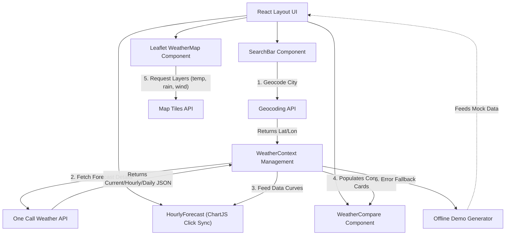

# 🌌 SkyPulse — Premium Weather Dashboard

**SkyPulse** is a state-of-the-art, fully responsive modern weather dashboard that delivers real-time meteorological conditions, predictive hourly charts, weekly outlook comparisons, and interactive weather maps with beautiful glassmorphic aesthetics.

> 🌐 **Live Website URL:** [skypulse-inky.vercel.app](https://skypulse-inky.vercel.app)

---

## 👥 Team Members

* **Addrienne Joseph Lobiano** (`aj515`) — *Full Stack* ([GitHub Profile](https://github.com/aj515))
* **Achilly Ceasar Sarsalejo** — *Backend API*
* **James Christopher Estacion** — *Backend web*
* **Danniezon Meir Po** — *Frontend*
* **Miguel Ben Nathaniel Pareja** — *Frontend*
* **Kyth Andre Carael** — *Quality Assurance (QA)*

---

## 🚀 Key Features

### 🌟 Main Features
1. **🔍 Real-Time City Searches:** Fetch real-time temperature, wind, UV index, cloudiness, humidity, pressure, and visibility metrics for any city globally via OpenWeatherMap APIs.
2. **📜 Search History Persistence:** Automatically stores user search history in browser `localStorage` with a fast-acting, dynamic dropdown for rapid query access.
3. **📊 Side-by-Side City Comparisons:** Dynamically compare forecast conditions, humidity, pressure, wind, and custom comparative descriptions between your searched city and any comparison city (e.g. Tokyo, London, Singapore).

### ✨ Premium Secondary Features
* **🗺️ Interactive Weather Map Layers:** Embedded **Leaflet** with **OpenStreetMap** supporting interactive weather radar overlays (Temperature, Clouds, Precipitation, and Wind).
* **🗣️ Dynamic Language Translation (i18n):** Real-time language switching between **English (US)**, **Spanish (ES)**, and **French (FR)** powered by `react-i18next`.
* **🌡️ Metrics & Units Converter:** On-the-fly toggling between Metric (°C, m/s, hPa) and Imperial (°F, mph, inHg) systems across the dashboard.
* **💖 Favorited & Bookmarked Cities:** Pin and save your favorite locations to a persistent quick-access drawer panel.
* **📈 Click-to-Chart Sync:** Click on any scrollable hourly time card to programmatically snap the Line Chart below to that data node and pop open its corresponding tooltip statistics.
* **🎨 Custom Hand-Crafted Weather SVGs:** Motion illustrations replacement for standard weather cartoon sprites.
* **⛈️ Severe Weather Advisories:** Interactive warnings banner for severe atmospheric warnings.
* **🛡️ Fail-Safe Offline Mode:** Smart fallback generating localized mock predictions when API keys are unauthorized or reach their free tier limits.

---

## 🏗️ Client-Server-API Flow Diagram



---

## 🛠️ Installation & Setup Instructions

Ensure you have [Node.js](https://nodejs.org/) (v16+ recommended) installed on your system.

### 1. Clone the repository
```bash
git clone https://github.com/aj515/SkyPulse.git
cd SkyPulse
```

### 2. Install dependencies
```bash
npm install
```

### 3. Set up Environment Variables
Create a `.env` file in the root directory and add your OpenWeatherMap API Key:
```env
VITE_OPENWEATHER_API_KEY=YOUR_OPENWEATHERMAP_API_KEY
```

### 4. Run the development server
```bash
npm run dev
```
Open your browser and navigate to: `http://localhost:5173/`

### 5. Build for Production
To generate an optimized build output bundle in the `/dist` directory:
```bash
npm run build
npm run preview
```

---

## 📂 Repository Organization & Structure

Our source files are organized into logical directories for clean architecture:

* 📁 **`/src`** — Core web application source code.
  * 📁 **`/components`** — Reusable glassmorphic UI components (maps, search bar, icons, side-by-side grids).
  * 📁 **`/context`** — Active state managers (Theme, Language, and API contexts).
  * 📁 **`/api`** — Weather fetch integrations and geolocation reverse lookups.
  * 📁 **`/locales`** — Internationalization dictionaries for English, Spanish, and French.
  * 📁 **`/utils`** — Demoware caching layers, formatters, and baseline variables.
* 📁 **`/docs`** — Standard project documentation.
  * 📄 **[`docs/api_documentation.md`](file:///c:/Users/Addrienne/Desktop/Weather/docs/api_documentation.md)** — Comprehensive documentation for direct/reverse geocoding, OneCall, and map layer endpoints.
  * 📄 **[`docs/postman_collection.json`](file:///c:/Users/Addrienne/Desktop/Weather/docs/postman_collection.json)** — Complete JSON collection export ready to import directly into Postman.
  * 📄 **[`docs/architecture.md`](file:///c:/Users/Addrienne/Desktop/Weather/docs/architecture.md)** — Comprehensive Client-Server flow details and interactive Mermaid graphs.

---

## 📜 Environment Variables Guide

SkyPulse relies on standard client-side environment configurations. In Vite, environment variables must be prefixed with `VITE_` to prevent accidental exposure of raw variables to the browser runtime.

| Variable Name | Type | Description | Required | Example |
| :--- | :--- | :--- | :--- | :--- |
| `VITE_OPENWEATHER_API_KEY` | `string` | Your active personal OpenWeatherMap subscription key. | **Yes** | `672fa5ded1db478f8d846781cf0f7073` |

*Note: In the absence of an API key, SkyPulse will dynamically prompt the user or load in localized **Offline Demo Mode**.*
