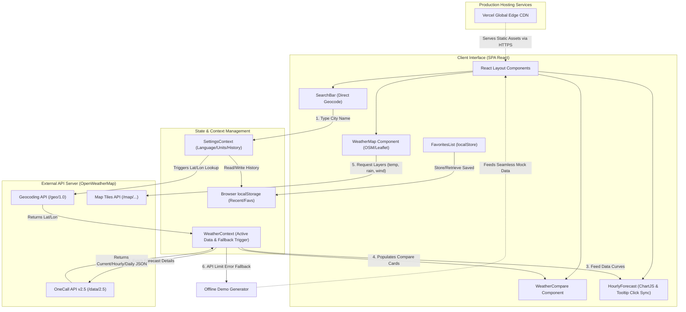

# 🏗️ SkyPulse — Architecture Flow Diagram

This document describes the architectural flow, component relationships, data synchronization, and API integration paths of the **SkyPulse Weather Dashboard** web application.

---

## 🗺️ Client-Server-API Architecture Flow

---

## 📊 Flow Sequence Description

1. **User Action (Search City):** The user types in the `SearchBar`. A debounced coordinates check queries the OpenWeatherMap **Geocoding API**.
2. **Coordinate Resolution & Fetch:** 
   - If the geocode succeeds, the active city is set in `SettingsContext`.
   - `WeatherContext` receives the `lat` / `lon` and triggers a fetch query to OpenWeatherMap's comprehensive **One Call API** (to get 24-hour hourly, 7-day daily, and warning alerts).
   - If the geocode or weather API fails (or key is unauthorized), the **Offline Demo Generator** intercepts immediately to populate mock parameters, ensuring no break in usability.
3. **Local Storage Synchronization:** Search history and user favorited cities are serialized and written directly to the client browser's `localStorage` for complete state conservation between active sessions.
4. **Interactive Overlays:**
   - **Line Chart (ChartJS):** The hourly forecast maps temperature and rain coordinates. Card click inputs programmatically set active chart nodes to highlight targets and launch tooltips.
   - **Map Tiles Component (Leaflet + OpenStreetMap):** Leaflet loads OSM map vectors, and overlays tiles requested from the OpenWeatherMap **Map Layers API** (precipitation, cloud cover, winds, temperatures).
5. **Static Server Deployment:** The production frontend SPA is optimized, bundled, and served to clients instantly via **Vercel's global edge network** with pre-configured rewrite redirect pathways.
